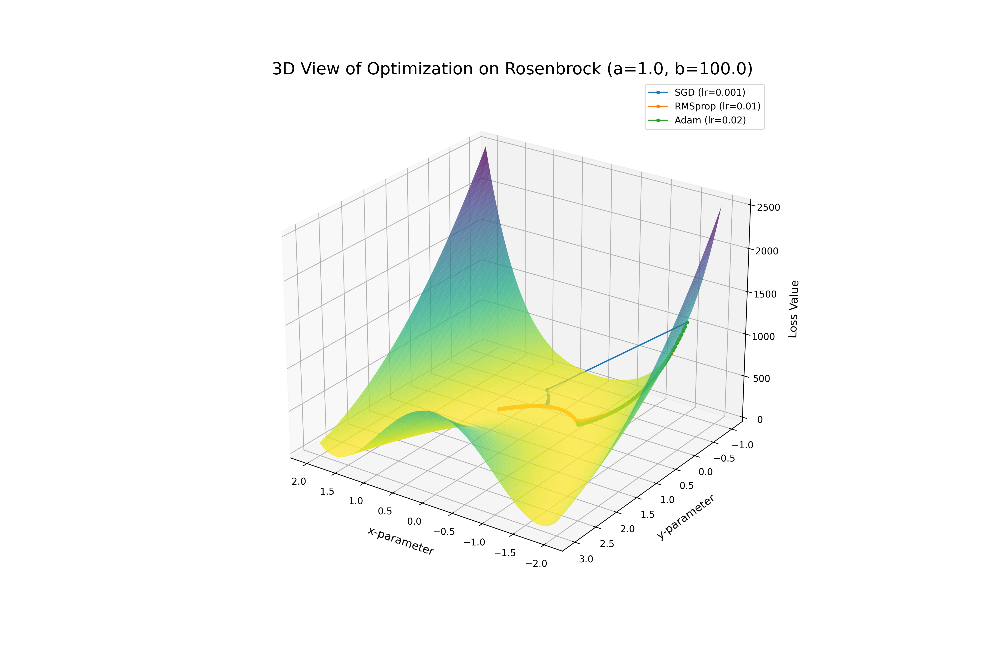

# Gradient Descent Variants

A Python project for implementing, visualizing, and understanding gradient-based optimization algorithms from scratch. This toolkit provides a "glass box" environment to see how optimizers like SGD, RMSprop, and Adam navigate different loss landscapes.


*3D view of the Rosenbrock "banana" function with optimizer paths overlaid*

---

## Table of Contents

* [Core Concept: The Hiker on a Landscape](#core-concept-the-hiker-on-a-landscape)
* [Key Features](#key-features)
* [Visualizations Gallery](#visualizations-gallery)

  * [2D Contour Plots: The Path](#2d-contour-plots-the-path)
  * [3D Surface Plots: The Terrain](#3d-surface-plots-the-terrain)
  * [Convergence Plots: The Speed](#convergence-plots-the-speed)
* [Installation](#installation)
* [Usage Guide](#usage-guide)

  * [Running Experiments](#running-experiments)
  * [Interactive Notebooks](#interactive-notebooks)
* [How It Works: Code Architecture](#how-it-works-code-architecture)

  * [Project Structure](#project-structure)
  * [The Core Interaction](#the-core-interaction)
* [How to Extend the Project](#how-to-extend-the-project)

  * [Adding a New Optimizer](#adding-a-new-optimizer)
  * [Adding a New Loss Function](#adding-a-new-loss-function)
* [License](#license)

---

## Core Concept: The Hiker on a Landscape

This project is built around a simple analogy:

* A **Loss Function** is a hilly terrain where low points represent low error.
* An **Optimizer** is a blindfolded hiker trying to find the lowest point.
* The **Gradient** is the slope of the ground beneath the hiker's feet.

Different optimizers are simply different strategies for the hiker to take their next step. SGD is a naive hiker, while Adam is a more sophisticated hiker with a sense of momentum and adaptability. This project lets you watch these different hikers navigate the terrain.

---

## Key Features

* **From-Scratch Implementations**: `SGD`, `RMSprop`, and `Adam` written in pure Python and NumPy for clarity.
* **Classic Test Landscapes**: Includes the convex `Quadratic` bowl and the challenging non-convex `Rosenbrock` function.
* **Rich Visualization Suite**: Generate 2D contour, 3D surface, and 2D convergence plots to analyze optimizer behavior.
* **Modular "Plug-and-Play" Design**: Easily add new optimizers or loss functions thanks to an architecture based on Abstract Base Classes.
* **Quantitative Analysis**: Scripts to run experiments and export performance metrics (like final loss and distance to minimum) to CSV files.

---

## Visualizations Gallery

*To generate these images, run:*

```bash
python -m experiments.basic_comparison
```

### 2D Contour Plots: The Path

These top-down "maps" show the step-by-step path each optimizer takes. The difference in strategy on the Rosenbrock function is striking.


### 3D Surface Plots: The Terrain

These plots provide the most intuitive view of the landscape's shape, showing the "mountains" and "valleys" the optimizers must navigate.


### Convergence Plots: The Speed

These graphs directly answer: "How fast does each optimizer find a good solution?" by plotting the loss at each iteration.


---

## Installation

1. **Clone the Repository:**

```bash
git clone https://github.com/your-username/gradient-descent-variants.git
cd gradient-descent-variants
```

2. **Create and Activate a Virtual Environment (Recommended):**

```bash
# On Windows
python -m venv .venv
.\.venv\Scripts\activate

# On macOS/Linux
python3 -m venv .venv
source .venv/bin/activate
```

3. **Install the Project and Dependencies:**
   This command uses `setup.py` to install the project in editable mode along with all required libraries.

```bash
pip install -e .
```

---

## Usage Guide

### Running Experiments

Scripts in the `experiments/` directory should be run as modules from the project root.

* **Run the main visual comparison:**

```bash
python -m experiments.basic_comparison
```

* **Analyze hyperparameter sensitivity:**

```bash
python -m experiments.hyperparameter_sensitivity
```

* **Run quantitative analysis and save to CSV:**

```bash
python -m experiments.convergence_analysis
```

### Interactive Notebooks

For a guided, story-driven analysis, start Jupyter and explore the `notebooks/` directory.

```bash
jupyter lab
```

---

## How It Works: Code Architecture

The project is built on a modular design where components are interchangeable. This is achieved through a "contract" system using Python's Abstract Base Classes (ABCs).

### Project Structure

```
gradient-descent-variants/
├── README.md
├── setup.py
├── src/
│   ├── optimizers/         # Optimizer implementations (Adam, SGD, etc.)
│   │   └── base_optimizer.py  # The Optimizer "contract"
│   ├── loss_functions/     # Loss function implementations
│   │   └── base_function.py   # The Loss Function "contract"
│   ├── visualization/      # All plotting functions
│   └── utils/              # Experiment runner and other helpers
├── experiments/            # Standalone scripts for running comparisons
├── notebooks/              # Jupyter notebooks for analysis
└── results/                # Output directory for plots and data
```

### The Core Interaction

The entire project hinges on the interaction between a `loss_function` object and an `optimizer` object, managed by the `run_optimization` utility. This design ensures any optimizer can work with any loss function.

Here is the simplified logic from `src/utils/experiment_runner.py`:

```python
# The central loop that powers every experiment
for _ in range(num_iterations):
    # 1. Get the slope from the loss function at the current position
    gradients = loss_function.gradient(params)

    # 2. Give the current position and slope to the optimizer to get the next position
    params = optimizer.step(params, gradients)

    # 3. Record the new position and repeat
    history.append(params)
```

---

## How to Extend the Project

### Adding a New Optimizer

1. Create a new file in `src/optimizers/`, e.g., `adagrad.py`.
2. Create a class `AdaGrad` that inherits from `BaseOptimizer`.
3. Implement its `__init__` and `step()` methods with the AdaGrad logic.
4. Import it in `src/optimizers/__init__.py`.
5. You can now use AdaGrad in any experiment.

### Adding a New Loss Function

1. Create a new file in `src/loss_functions/`, e.g., `rastrigin.py`.
2. Create a class `Rastrigin` that inherits from `BaseFunction`.
3. Implement its `evaluate()` and `gradient()` methods.
4. Import it in `src/loss_functions/__init__.py`.
5. You can now use the Rastrigin function in any experiment.

---

## License

MIT License
