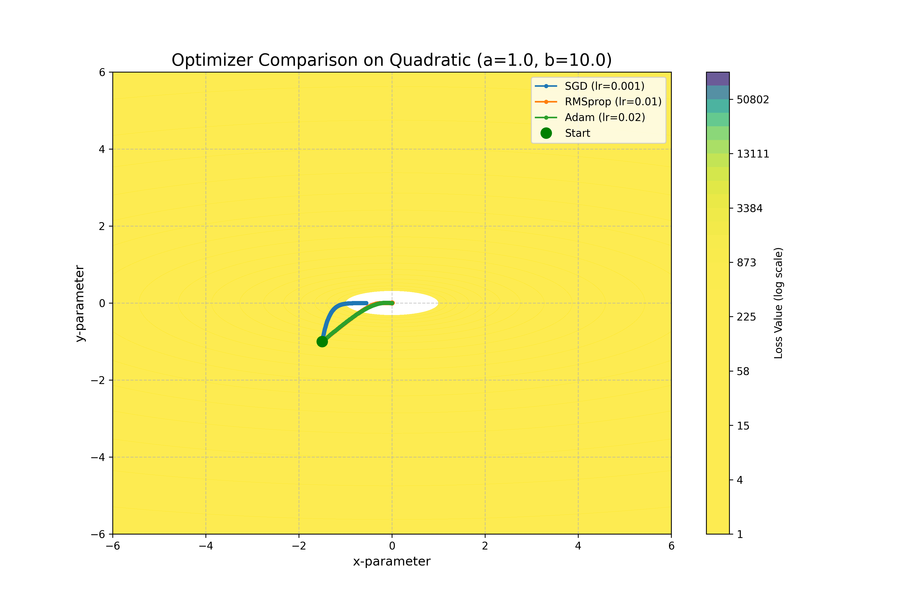
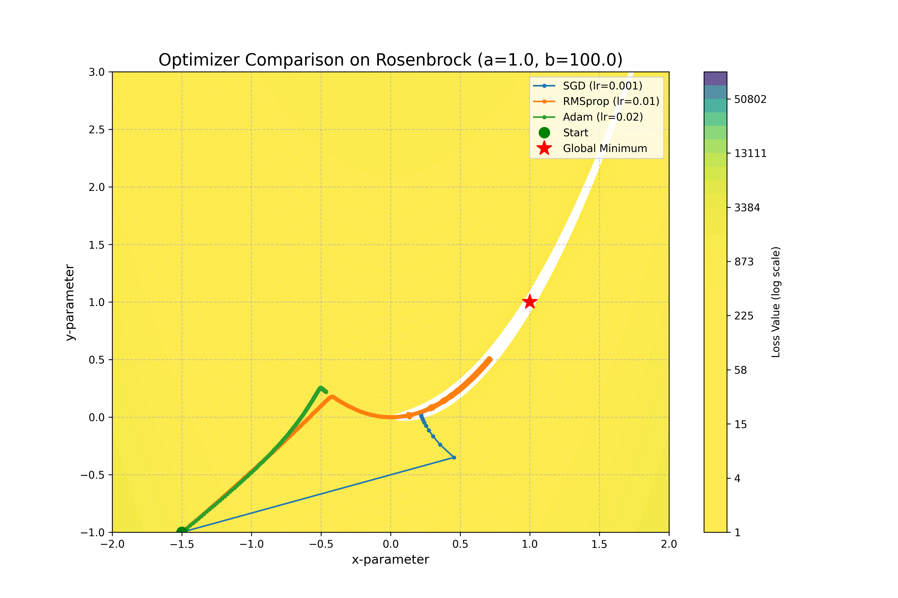
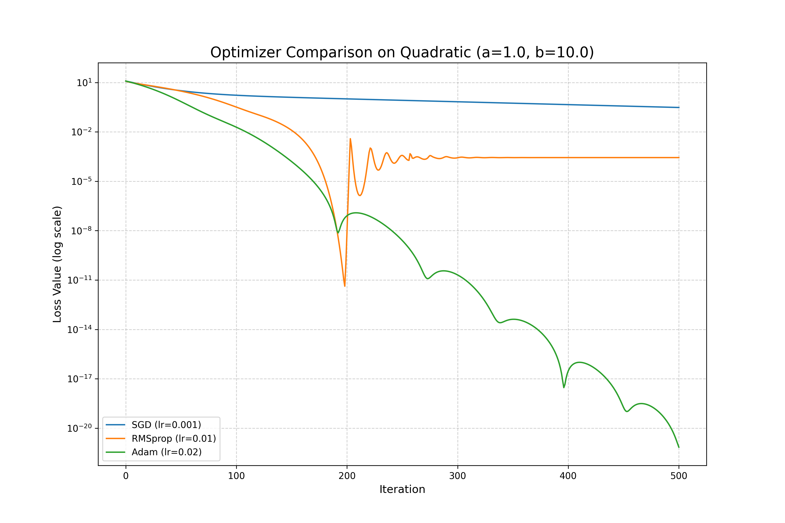
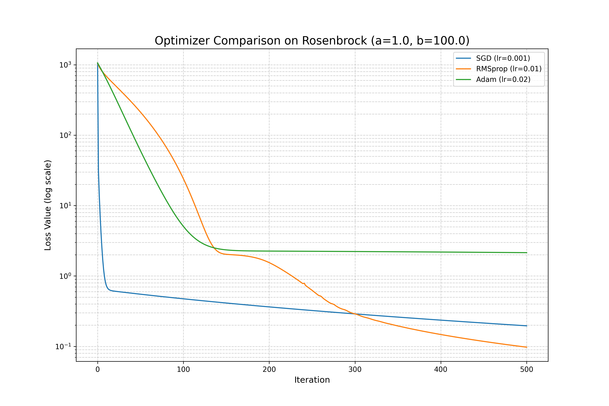

# Gradient Descent Variants

A clean and modular Python project that implements and compares optimization algorithms: **SGD**, **Adam**, and **RMSprop**. The project explores how each optimizer behaves on different types of loss landscapes using visualizations.

## Features

- Custom implementation of:

- Stochastic Gradient Descent (SGD)
- RMSprop
- Adam
- Optimization over test functions:

- Quadratic (Convex)
- Rosenbrock (Non-convex)
- Visualizations:

- 2D Contour plots with optimizer paths
- Log-scaled loss surface coloring
- Modular code using base classes

## Installation

```bash
git clone https://github.com/yourusername/gradient-descent-variants.git
cd gradient-descent-variants
pip install -e .
```

Or install dependencies:

```bash
pip install -r requirements.txt
```

## Run an Experiment

```bash
python -m experiments.basic_comparison
```

This will:

- Run all optimizers on the selected loss function
- Save the comparison plot to `results/plots/`

## Example Output

### Contour plots showing optimization paths of each optimizer across loss landscapes like Quadratic.



You can also compare on non-convex functions like Rosenbrock:



### Convergence plots show the loss value at each iteration

On the Quadratic function:


On the Rosenbrock function:



## Learning Objectives

- Understand optimizer behavior on convex vs non-convex functions
- Practice implementing optimization algorithms from scratch
- Build modular and extensible ML codebases

## License

MIT License
